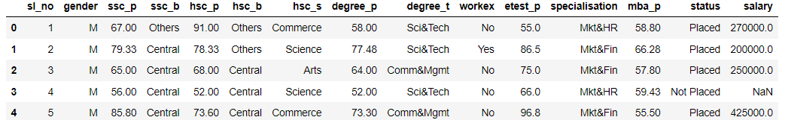
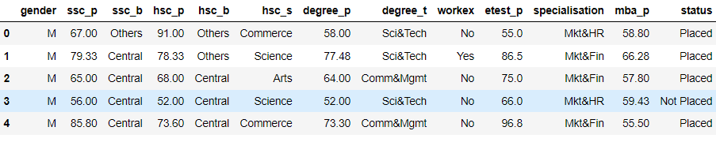
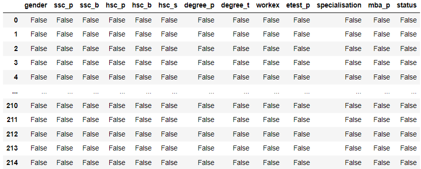
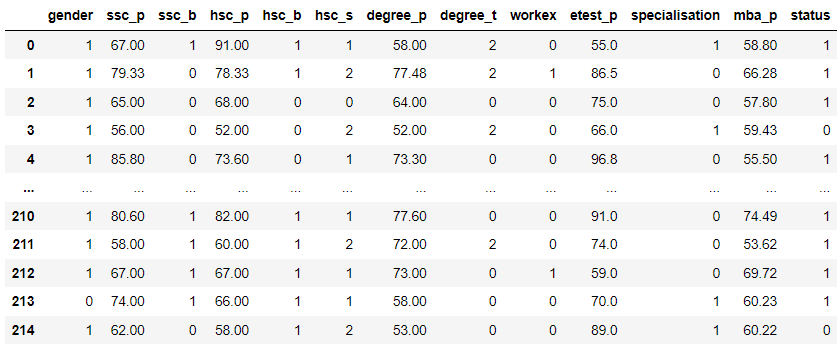
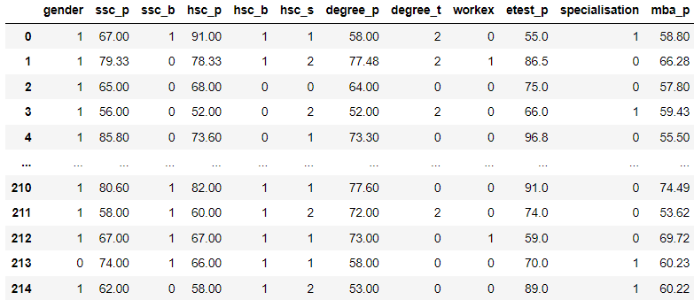
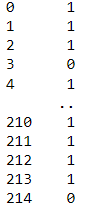
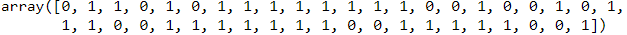
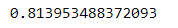
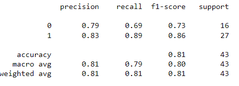

<h3>Date:</h3>
<h2>Exp: 04</h2>

# Implementation of Logistic Regression Model to Predict the Placement Status of Student

## AIM:
To write a program to implement the the Logistic Regression Model to Predict the Placement Status of Student.

## Equipments Required:
1. Hardware – PCs
2. Anaconda – Python 3.7 Installation / Jupyter notebook

## Algorithm
1.Use the standard libraries in python for finding linear regression.

2.Set variables for assigning dataset values.

3.Import linear regression from sklearn.

4.Predict the values of array.

5.Calculate the accuracy, confusion and classification report by importing the required modules from sklearn.

6.Obtain the graph. 

## Program:

Program to implement the the Logistic Regression Model to Predict the Placement Status of Student.

Developed by: Sabari Akash A

RegisterNumber: 212222230124
```py
import pandas as pd
data=pd.read_csv("C:/Users/SEC/Downloads/Placement_Data.csv")
data.head()

data1=data.copy()
data1=data1.drop(["sl_no","salary"],axis=1)
data1.head()

data1.isnull()

data1.duplicated().sum()

from sklearn .preprocessing import LabelEncoder
le=LabelEncoder()
data1["gender"]=le.fit_transform(data1["gender"])
data1["ssc_b"]=le.fit_transform(data1["ssc_b"])
data1["hsc_b"]=le.fit_transform(data1["hsc_b"])
data1["hsc_s"]=le.fit_transform(data1["hsc_s"])
data1["degree_t"]=le.fit_transform(data1["degree_t"])
data1["workex"]=le.fit_transform(data1["workex"])
data1["specialisation"]=le.fit_transform(data1["specialisation"])
data1["status"]=le.fit_transform(data1["status"])
data1

x=data1.iloc[:,:-1]
x

y=data1["status"]
y

from sklearn.model_selection import train_test_split
x_train,x_test,y_train,y_test=train_test_split(x,y,test_size=0.2,random_state=0)

from sklearn.linear_model import LogisticRegression
lr=LogisticRegression(solver="liblinear")
lr.fit(x_train,y_train)
y_pred=lr.predict(x_test)
y_pred

from sklearn.metrics import accuracy_score
accuracy=accuracy_score(y_test,y_pred)
accuracy

from sklearn.metrics import classification_report
classification_report1=classification_report(y_test,y_pred)
print(classification_report1)

lr.predict([[1,80,1,90,1,1,90,1,0,85,1,85]])
```

## Output:













## Result:
Thus the program to implement the the Logistic Regression Model to Predict the Placement Status of Student is written and verified using python programming.
